# 画面遷移図 — イケメンデート

> `docs/design/screens.md` の全16画面をもとに作成。
> シナリオごとにフローを分割して記載する。

---

## シナリオ一覧

| # | シナリオ | 対象 |
|---|---|---|
| 1 | 初回登録フロー（女性） | 新規ユーザー（女性） |
| 2 | 初回登録フロー（男性） | 新規ユーザー（男性） |
| 3 | ログインフロー | 既存ユーザー |
| 4 | パスワードリセットフロー | ログイン失敗ユーザー |
| 5 | メイン機能フロー（女性） | ログイン済み女性 |
| 6 | メイン機能フロー（男性） | ログイン済み男性 |
| 7 | チャットフロー | マッチング済みユーザー |
| 8 | 退会フロー | 退会希望ユーザー |
| 9 | エラー・エッジケース | 全ユーザー |
| 10 | 通知バッジフロー | ログイン済み全ユーザー |

---

## 1. 初回登録フロー（女性）

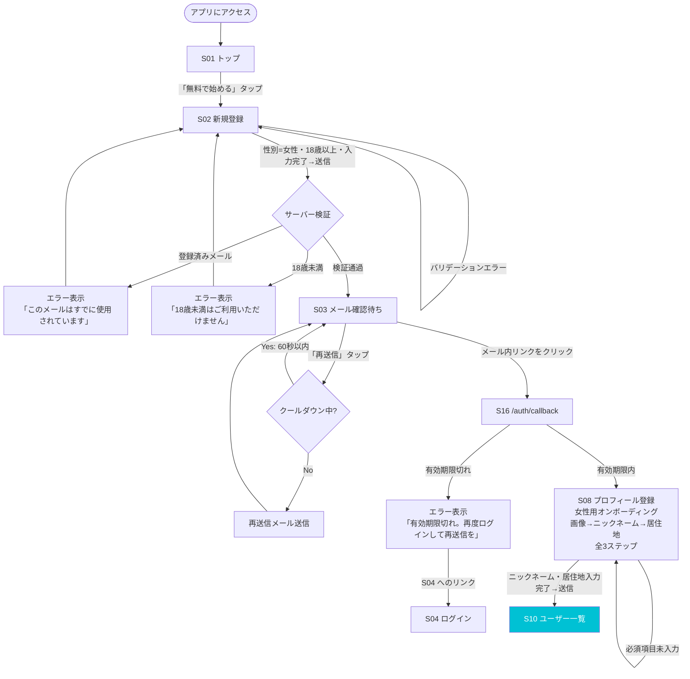

---

## 2. 初回登録フロー（男性）

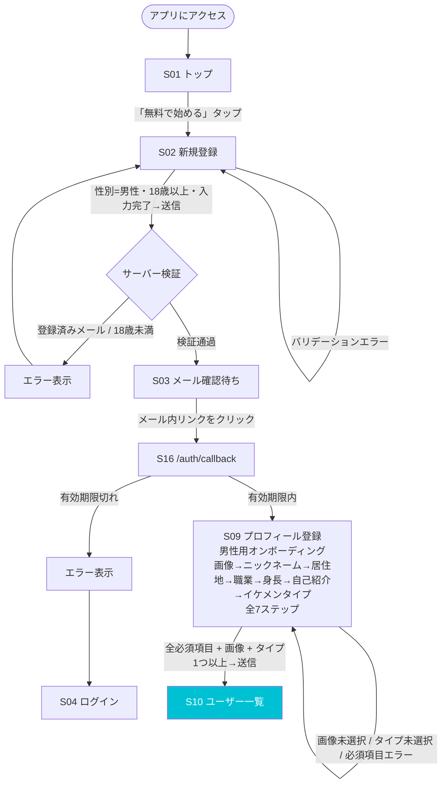

---

## 3. ログインフロー

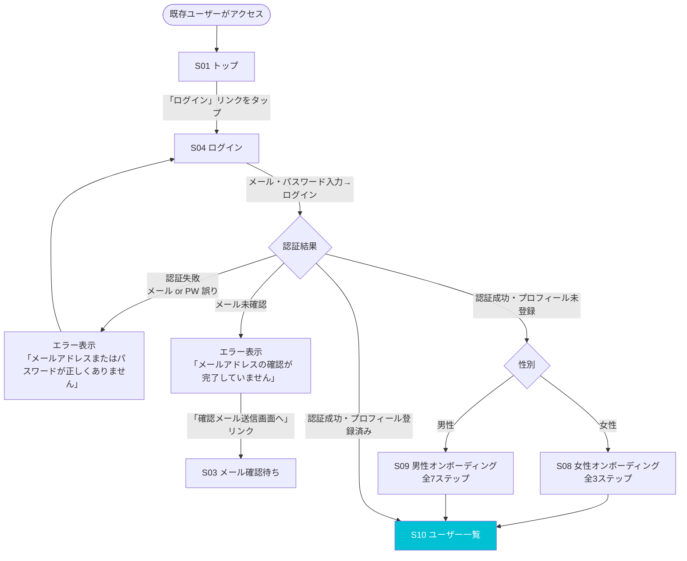

---

## 4. パスワードリセットフロー

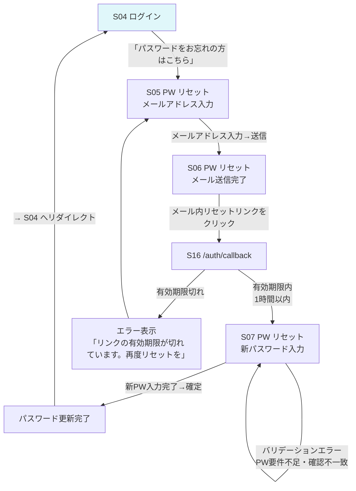

---

## 5. メイン機能フロー（女性）

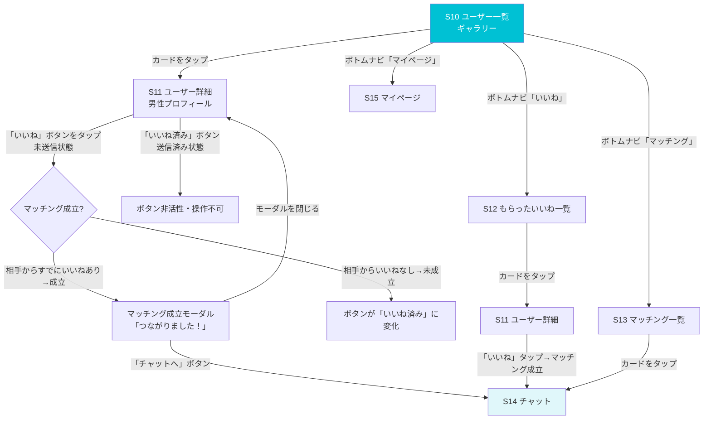

---

## 6. メイン機能フロー（男性）

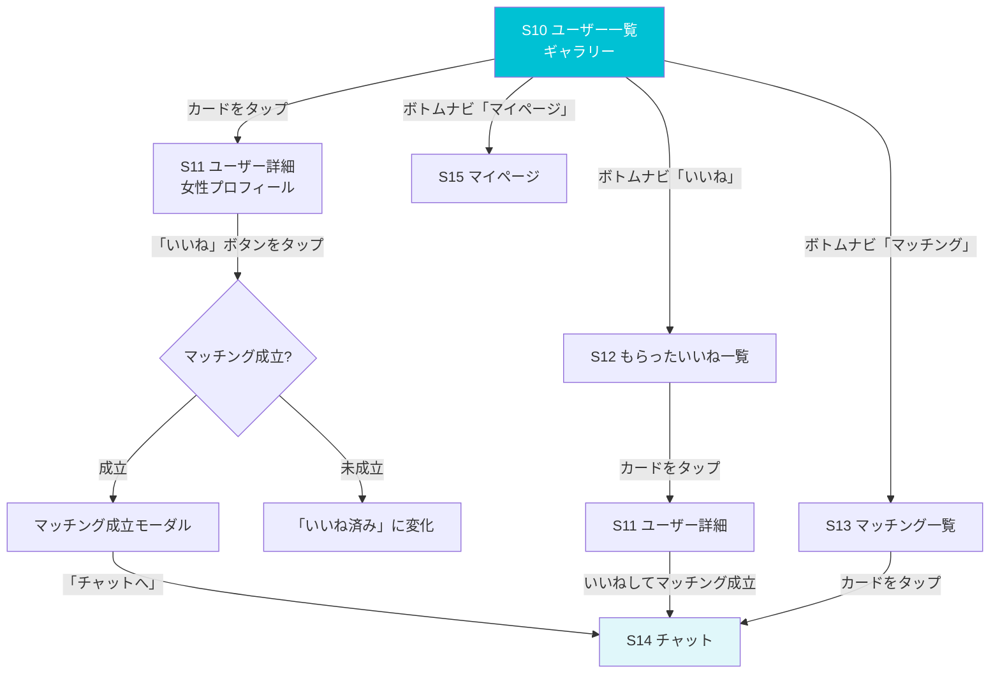

---

## 7. チャットフロー

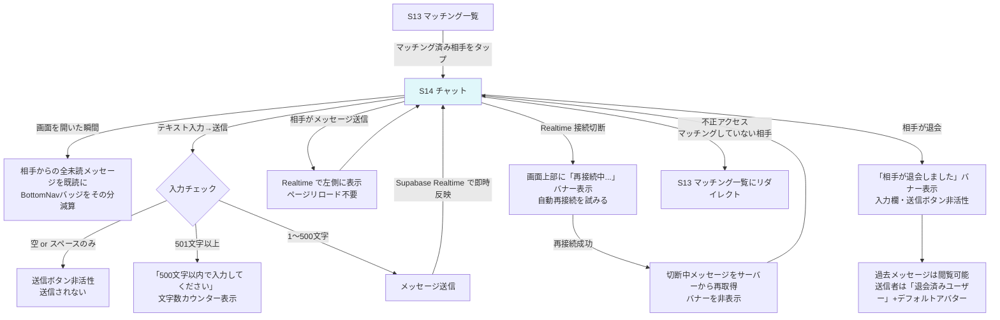

---

## 8. 退会フロー

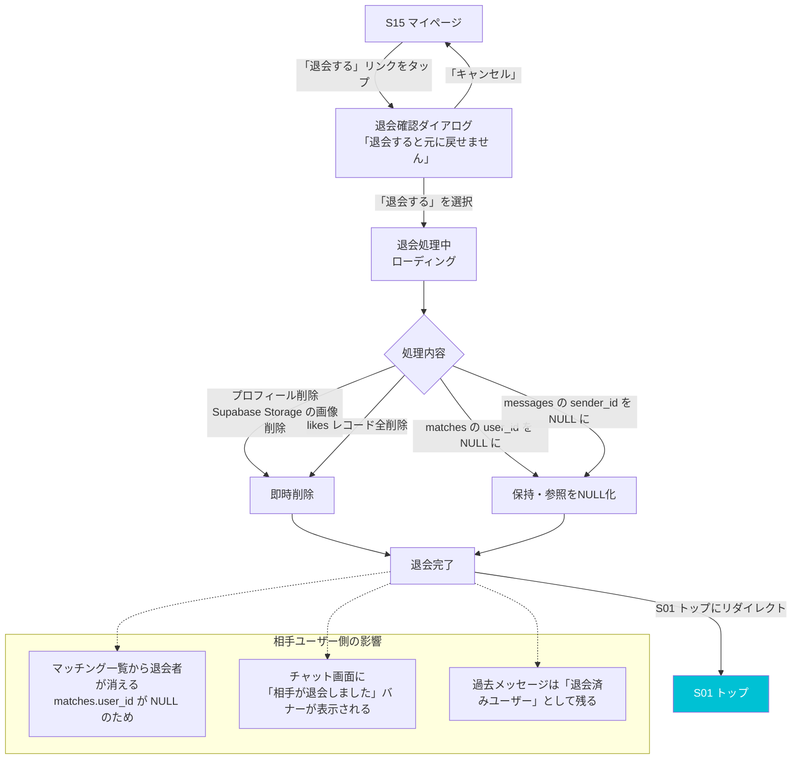

---

## 9. エラー・エッジケース

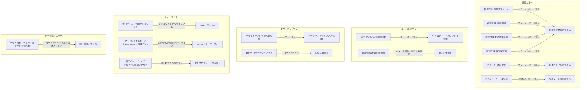

---

## 10. 通知バッジフロー

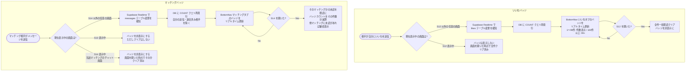

---

## 画面間の全遷移まとめ

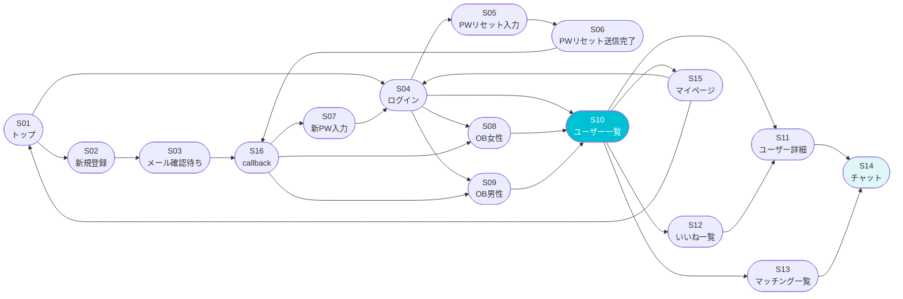

---

## 更新履歴

| 日付 | 内容 |
|---|---|
| 2026-05-24 | 初版作成（screens.md v2026-05-24 をもとに9シナリオを定義） |
| 2026-05-24 | シナリオ7にRealtime切断・再接続フローと既読処理を追加。シナリオ10（通知バッジフロー）を新規追加 |
